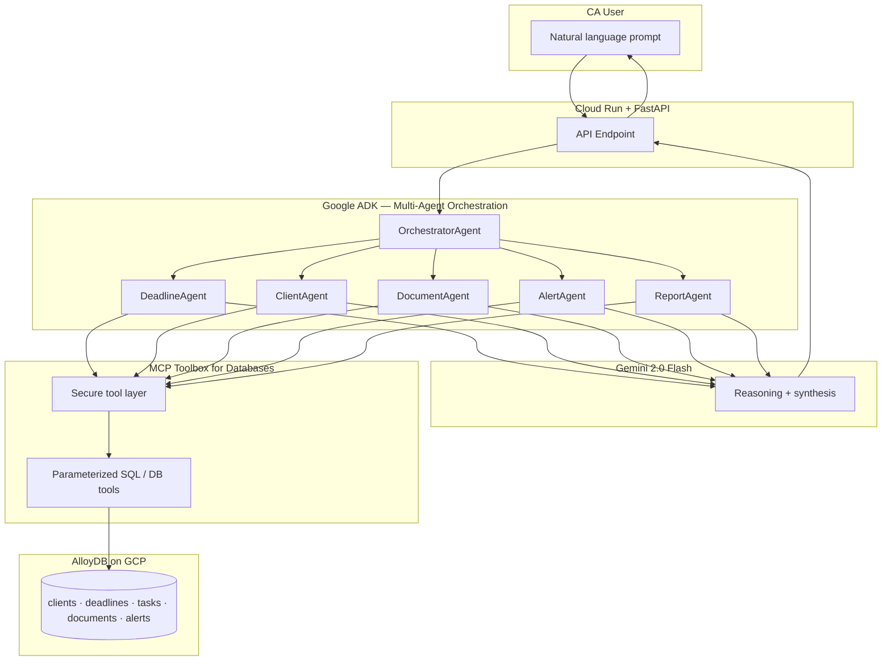

<div align="center">

# 🏛️ CA Command Center

**Your AI-powered morning briefing for GST, ITR, TDS, ROC — one prompt, six agents, zero missed deadlines.**

[](https://cloud.google.com/)
[](https://www.python.org/downloads/)
[](https://google.github.io/adk-docs/)
[](https://deepmind.google/technologies/gemini/)
[](https://google.github.io/genai-toolbox/)
[](https://cloud.google.com/alloydb)
[](https://cloud.google.com/run)

**Hackathon:** Gen AI Academy APAC Edition · **Presented by:** Google Cloud × Hack2skill  
**Track:** Multi-Agent Productivity Assistant · **Team:** Hari R

[Problem](#problem-statement--why-indias-cas-need-this) ·
[Solution](#solution-overview) ·
[Architecture](#architecture) ·
[Agents](#agent-crew) ·
[Setup](#local-setup) ·
[Deploy](#cloud-run-deployment) ·
[API](#api-usage)

</div>

---

## 📑 Table of Contents

1. [Problem Statement — Why India’s CAs Need This](#problem-statement--why-indias-cas-need-this)
2. [Solution Overview](#solution-overview)
3. [Architecture](#architecture)
4. [Agent Crew](#agent-crew)
5. [Tech Stack](#tech-stack)
6. [Prerequisites](#prerequisites)
7. [Local Setup](#local-setup)
8. [Cloud Run Deployment](#cloud-run-deployment)
9. [API Usage](#api-usage)
10. [Database Schema](#database-schema-overview)
11. [Demo](#demo--try-these-prompts)
12. [Why This Wins](#why-this-wins)
13. [Future Roadmap](#future-roadmap)
14. [License](#license)

---

## 🎯 Problem Statement — Why India’s CAs Need This

India is home to **1M+ practising Chartered Accountants** who juggle compliance for dozens of clients at once. For a typical CA firm:

| Reality on the ground | What goes wrong |
|----------------------|-----------------|
| **GST** (GSTR-1, GSTR-3B, reconciliations) | Late filing → interest + penalties |
| **Income Tax** (ITR variants, advance tax) | Missed due dates → notices & client churn |
| **TDS** (quarterly returns, Form 16/16A) | Defaults traced via TRACES |
| **ROC / MCA** (annual filings, DIR-3 KYC) | Strike-off risk, director disqualification |

Most firms still run this on **spreadsheets**, email threads, and memory. A single missed cell or untracked thread can mean **heavy penalties** and reputational damage. Clients expect proactive reminders; regulators expect punctual filings.

> **There is no AI-native, multi-agent system built specifically for this CA workflow** — one that understands GST vs ITR vs TDS vs ROC, pulls live structured data, and returns a **prioritized action plan** in natural language.

**CA Command Center** closes that gap: it is designed as a **productivity OS** layer on top of real client data — not a generic chatbot.

---

## 💡 Solution Overview

**CA Command Center** is a **multi-agent AI system** built with **Google’s Agent Development Kit (ADK)** and **Gemini 2.0 Flash**. A CA types **one natural-language prompt**; an **Orchestrator** interprets intent and coordinates **specialist agents** that query firm data through **MCP Toolbox for Databases**, backed by **AlloyDB on Google Cloud**.

In seconds, the system can synthesize:

- **Upcoming deadlines** (GST, ITR, TDS, ROC) with dates and client context  
- **Overdue filings** that need immediate escalation  
- **Pending client tasks** (follow-ups, reconciliations, board resolutions)  
- **Document collection status** (Form 16, invoices, ROC papers)  
- **Critical alerts** (e.g. **3-day horizon** for statutory due dates)  
- A polished **daily CA morning briefing** — the “command center” view to start the day  

The demo dataset includes **150+ realistic rows** across **20 clients**, **40 deadlines**, **40 tasks**, **30 documents**, and **20 alerts** — enough to stress-test routing, SQL tools, and narrative quality in a hackathon demo.

---

## 🗺️ Architecture

The flow is intentionally **tool-first**: agents do not hallucinate compliance dates; they **read AlloyDB** via MCP-governed tools, then **Gemini** composes clear, actionable language for the CA.



### ✨ Design highlights

- **Orchestration:** ADK manages agent handoffs, tool policies, and conversation state.  
- **Grounding:** MCP Toolbox exposes **least-privilege** database access — ideal for hackathon and production-hardening stories.  
- **Scale path:** Same pattern extends to more tables (billing, team workload, audit trails) without rewriting the LLM core.

---

## 🤖 Agent Crew

The system uses **one orchestrator** plus **five specialist agents** (six ADK agents total). Each specialist owns a slice of the CA operating rhythm and calls **MCP/AlloyDB tools** instead of inventing facts.

| Agent | Responsibility | Typical tools / capabilities |
|-------|----------------|------------------------------|
| **OrchestratorAgent** | Parses user intent, selects sub-agents, merges partial results into one coherent answer | Intent routing, ADK sub-agent calls, session policy |
| **DeadlineAgent** | GST / ITR / TDS / ROC **due dates**, status (`pending` / `filed`), assignment | SQL via MCP: `deadlines` joined with `clients` |
| **ClientAgent** | Per-client **tasks**, priorities, due dates, open vs done | SQL via MCP: `tasks`, `clients` |
| **DocumentAgent** | **Document collection** — what arrived, what’s missing, notes | SQL via MCP: `documents`, `clients` |
| **AlertAgent** | **Critical windows** (e.g. next **3 days**), overdue banners, reminder queue | SQL via MCP: `alerts`, `deadlines` |
| **ReportAgent** | **Daily morning briefing** — executive summary, prioritized bullets, risk ordering | Summarization over aggregated tool outputs + Gemini |

Together, they implement the hackathon track vision: a **true multi-agent productivity assistant**, not a single monolithic prompt to one tool-less model.

---

## 🛠️ Tech Stack

| Layer | Technology | Role |
|-------|------------|------|
| **Agents** | Google **ADK** | Multi-agent graphs, tools, orchestration |
| **Model** | **Gemini 2.0 Flash** | Fast, cost-effective reasoning for agent loops |
| **Tools** | **MCP Toolbox for Databases** | Secure middleware between agents and SQL |
| **Database** | **AlloyDB** (PostgreSQL-compatible) on **GCP** | Structured firm data at hackathon + production scale |
| **API** | **Python 3.11** + **FastAPI** | HTTP API for demos, webhooks, and integrations |
| **Hosting** | **Cloud Run** | Serverless containers, auto-scale, IAM-native security |

---

## ✅ Prerequisites

Before you run or deploy **CA Command Center**, ensure you have:

- **Python 3.11** installed and on your `PATH`  
- **Google Cloud SDK** (`gcloud`) configured for your project  
- An **AlloyDB** (or local Postgres for dev) instance with the schema loaded  
- **Gemini API** access (Vertex AI or Google AI Studio — per your ADK configuration)  
- **MCP Toolbox** configured to point at your database connection (connection string, secrets)  
- **Docker** (optional but recommended for Cloud Run local parity)  

> **Tip:** For hackathon judging, keep a **pre-seeded** database snapshot so demos are deterministic and impressive under time pressure.

---

## 🚀 Local Setup

Follow these steps to run the API and agents on your machine.

### 📥 1. Clone and enter the project

```bash
git clone https://github.com/<your-org>/ca-command-center.git
cd ca-command-center
```

### 🐍 2. Create and activate a virtual environment (Python 3.11)

**Windows (PowerShell)**

```powershell
py -3.11 -m venv .venv
.\.venv\Scripts\Activate.ps1
python -m pip install --upgrade pip
```

**macOS / Linux**

```bash
python3.11 -m venv .venv
source .venv/bin/activate
pip install --upgrade pip
```

### 📦 3. Install dependencies

```bash
pip install -r requirements.txt
```

*(If `requirements.txt` is not yet in your fork, add FastAPI, Uvicorn, Google ADK, and your MCP client libraries to match your agent code.)*

### 🔐 4. Configure environment variables

Create a `.env` file in the project root (never commit secrets):

```env
# Example — replace with your project values
GOOGLE_CLOUD_PROJECT=your-gcp-project-id
ALLOYDB_CONNECTION_NAME=project:region:cluster:instance
GEMINI_MODEL=gemini-2.0-flash
MCP_TOOLBOX_BASE_URL=http://localhost:5000
FASTAPI_HOST=0.0.0.0
FASTAPI_PORT=8080
```

### 🗄️ 5. Apply database schema and seed data

Run your DDL (create tables) against AlloyDB or local Postgres, then load the demo dataset:

```bash
psql "host=<HOST> port=<PORT> dbname=<DB> user=<USER> sslmode=require" \
  -f database/schema.sql

psql "host=<HOST> port=<PORT> dbname=<DB> user=<USER> sslmode=require" \
  -f database/seed_data.sql
```

The bundled **`database/seed_data.sql`** truncates and repopulates:

- **20** `clients`  
- **40** `deadlines`  
- **40** `tasks`  
- **30** `documents`  
- **20** `alerts`  

### 🔧 6. Start MCP Toolbox (if running locally)

Point Toolbox at the same database and expose the tool server URL your ADK agents expect (see Toolbox docs for your version).

```bash
# Illustrative — use the exact command from MCP Toolbox documentation
toolbox --prebuilt alloydb --tools-dir ./toolbox-config
```

### ▶️ 7. Run the FastAPI server

```bash
uvicorn app.main:app --host 0.0.0.0 --port 8080 --reload
```

Open `http://localhost:8080/docs` for interactive OpenAPI if enabled.

---

## ☁️ Cloud Run Deployment

Deploy the API container to **Cloud Run** in your preferred region (e.g. `asia-south1` for India-low-latency demos).

### 🚢 Build and deploy with source-based deploy

```bash
gcloud config set project YOUR_GCP_PROJECT_ID

gcloud run deploy ca-command-center \
  --source . \
  --region asia-south1 \
  --allow-unauthenticated \
  --set-env-vars "GOOGLE_CLOUD_PROJECT=YOUR_GCP_PROJECT_ID,GEMINI_MODEL=gemini-2.0-flash" \
  --min-instances 0 \
  --max-instances 3
```

### 🐳 (Alternative) Build with Artifact Registry

```bash
gcloud artifacts repositories create ca-cc-repo \
  --repository-format=docker \
  --location=asia-south1 \
  --description="CA Command Center images"

gcloud builds submit --tag asia-south1-docker.pkg.dev/YOUR_GCP_PROJECT_ID/ca-cc-repo/ca-command-center:latest

gcloud run deploy ca-command-center \
  --image asia-south1-docker.pkg.dev/YOUR_GCP_PROJECT_ID/ca-cc-repo/ca-command-center:latest \
  --region asia-south1 \
  --allow-unauthenticated
```

### 📋 Production checklist (post-hackathon)

- Use **Secret Manager** for DB passwords and API keys  
- Switch `--allow-unauthenticated` off; front with **Identity-Aware Proxy** or auth middleware  
- Restrict MCP Toolbox egress with **VPC** + **Private IP** to AlloyDB  

---

## 📡 API Usage

The API exposes a **single conversational endpoint** that forwards the user message to the **ADK multi-agent runner**. Replace `YOUR_CLOUD_RUN_URL` with your deployed URL or `http://localhost:8080`.

> **Convention used below:** `POST /v1/chat` with JSON `{ "message": "<prompt>" }`. Adjust the path to match your `FastAPI` router if it differs.

### 🌅 1. Morning briefing (primary demo)

```bash
curl -s -X POST "https://YOUR_CLOUD_RUN_URL/v1/chat" \
  -H "Content-Type: application/json" \
  -d "{\"message\": \"I just started my day. Give me my morning briefing.\"}"
```

### 🚨 2. Overdue filings deep-dive

```bash
curl -s -X POST "https://YOUR_CLOUD_RUN_URL/v1/chat" \
  -H "Content-Type: application/json" \
  -d "{\"message\": \"List all overdue GST, TDS, ITR, and ROC filings with client names and how late they are.\"}"
```

### 📂 3. Pending documents & client follow-ups

```bash
curl -s -X POST "https://YOUR_CLOUD_RUN_URL/v1/chat" \
  -H "Content-Type: application/json" \
  -d "{\"message\": \"Which clients are still missing key documents this quarter, and what should I chase today?\"}"
```

### ⏱️ 4. Critical 3-day alert window

```bash
curl -s -X POST "https://YOUR_CLOUD_RUN_URL/v1/chat" \
  -H "Content-Type: application/json" \
  -d "{\"message\": \"Show critical alerts and deadlines due in the next 3 days, prioritized by risk.\"}"
```

### 📤 Sample truncated response shape (illustrative)

```json
{
  "reply": "## Morning Briefing — CA Command Center\n- **Due today:** GSTR-3B — Rajesh Enterprises …\n- **Overdue:** ROC — Global Tech Solutions …\n- **Documents:** Chase Form 16 / bank statements …\n- **Top actions:** …",
  "agents_invoked": ["OrchestratorAgent", "DeadlineAgent", "AlertAgent", "ReportAgent"],
  "latency_ms": 4200
}
```

---

## 🧱 Database Schema Overview

All demo data lives in **five normalized tables** optimized for MCP tool queries and CA workflows.

### 🔗 Entity relationship (conceptual)

| Table | Purpose | Key columns (conceptual) |
|-------|---------|---------------------------|
| **clients** | Master list of assessees | `name`, `pan_number`, `gst_number`, `contact`, `category` (`business` / `individual`) |
| **deadlines** | Statutory filings | `client_id`, `filing_type`, `due_date`, `status`, `assigned_to` |
| **tasks** | Internal CA firm work | `client_id`, `description`, `priority`, `due_date`, `status` |
| **documents** | Evidence & paperwork | `client_id`, `doc_type`, `received_date`, `notes` |
| **alerts** | Precomputed reminders | `deadline_id`, `alert_date`, `message`, `sent` |

### 🏆 Why this schema wins demos

- **Join-friendly:** `deadlines` + `clients` answers “what’s due for whom?” in one query.  
- **Alert-rich:** `alerts` can highlight **overdue** vs **3-day** vs **same-day** with pre-written CA language.  
- **Realistic variety:** Mix of **GST**, **ITR**, **TDS**, **ROC**, **advance tax** rows mirrors actual firm work.

---

## 🎬 Demo — Try These Prompts

Use these **exact prompts** when recording your hackathon video or live judging session:

| # | Prompt | What judges should see |
|---|--------|-------------------------|
| 1 | **“I just started my day. Give me my morning briefing.”** | Orchestrator + **ReportAgent** synthesize a **single-page** executive summary. |
| 2 | **“List all overdue GST, TDS, ITR, and ROC filings with client names and how late they are.”** | **DeadlineAgent** + **AlertAgent** surface **grounded** rows, not generic advice. |
| 3 | **“Which clients are still missing key documents this quarter, and what should I chase today?”** | **DocumentAgent** + **ClientAgent** connect **paper gaps** to **tasks**. |
| 4 | **“Show critical alerts and deadlines due in the next 3 days, prioritized by risk.”** | **AlertAgent** demonstrates **time-window** reasoning on real `alerts` / `deadlines`. |

### 🎥 Recording tips

- Show **Cloud Run** URL + **latency** acceptable for real firms.  
- Flash **AlloyDB** row counts (**150+**) in console or SQL client for credibility.  
- Mention **MCP Toolbox** as the **security boundary** between LLM and data.

---

## 🏆 Why This Wins

### 🇮🇳 India-specific impact

- Speaks the **real language of Indian compliance**: GSTR-1/3B, ITR slabs, TDS quarters, ROC annual filings — not US-centric tax trivia.  
- Targets a **massive, under-served user base**: lakhs of CAs and small firms still on **Excel + WhatsApp**.  

### 🧠 True multi-agent design

- **Orchestrator + five specialists** map cleanly to how a **partner delegates** to article clerks — reviewers instantly “get” the architecture.  
- **Tool-grounded answers** via **MCP + AlloyDB** beat a single prompt to a raw LLM.  

### 📊 Credible dataset

- **150+ seeded records** across **20 clients** prove the system handles **portfolio scale**, not a toy 3-row CSV.  

### ☁️ Google Cloud native story

- **ADK** + **Gemini 2.0 Flash** + **AlloyDB** + **Cloud Run** is a coherent, **enterprise-grade** path from hackathon to pilot deployment.

---

## 🔮 Future Roadmap

| Horizon | Feature | Value for CAs |
|---------|---------|---------------|
| **Near-term** | **WhatsApp Business** alerts for D-3 / D-1 / D-day | Meet clients where they already coordinate |
| **Near-term** | **Auto penalty / interest estimator** | Translate overdue days into **₹ exposure** for prioritization |
| **Mid-term** | **Voice interface** (mobile + hands-free desk) | Dictate tasks during site audits and client calls |
| **Mid-term** | **Firm-wide workload balancing** | Route tasks across partners and articles by capacity |
| **Long-term** | **E-filing bot** (where legally permissible) | Close the loop from briefing → draft → file with human approval |

---

## 📜 License

This project is released under the **MIT License**.

```
MIT License

Copyright (c) 2026 Hari R

Permission is hereby granted, free of charge, to any person obtaining a copy
of this software and associated documentation files (the "Software"), to deal
in the Software without restriction, including without limitation the rights
to use, copy, modify, merge, publish, distribute, sublicense, and/or sell
copies of the Software, and to permit persons to whom the Software is
furnished to do so, subject to the following conditions:

The above copyright notice and this permission notice shall be included in all
copies or substantial portions of the Software.

THE SOFTWARE IS PROVIDED "AS IS", WITHOUT WARRANTY OF ANY KIND, EXPRESS OR
IMPLIED, INCLUDING BUT NOT LIMITED TO THE WARRANTIES OF MERCHANTABILITY,
FITNESS FOR A PARTICULAR PURPOSE AND NONINFRINGEMENT. IN NO EVENT SHALL THE
AUTHORS OR COPYRIGHT HOLDERS BE LIABLE FOR ANY CLAIM, DAMAGES OR OTHER
LIABILITY, WHETHER IN AN ACTION OF CONTRACT, TORT OR OTHERWISE, ARISING FROM,
OUT OF OR IN CONNECTION WITH THE SOFTWARE OR THE USE OR OTHER DEALINGS IN THE
SOFTWARE.
```

---

<div align="center">

**Built with discipline, deadlines, and a little help from Gemini.**

*Gen AI Academy APAC Edition · Google Cloud × Hack2skill · Multi-Agent Productivity Assistant Track*

</div>
