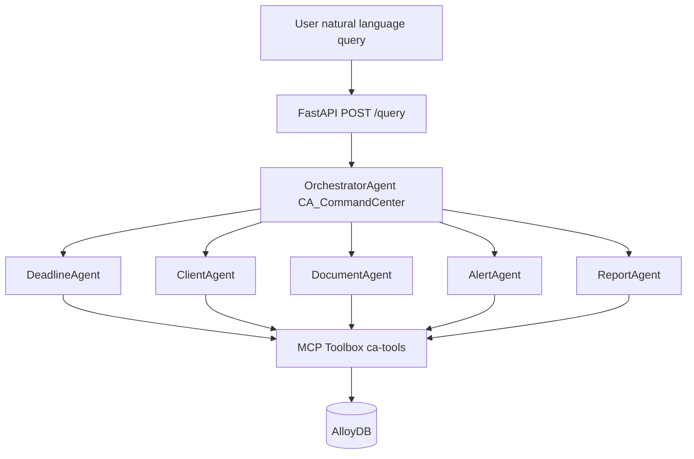
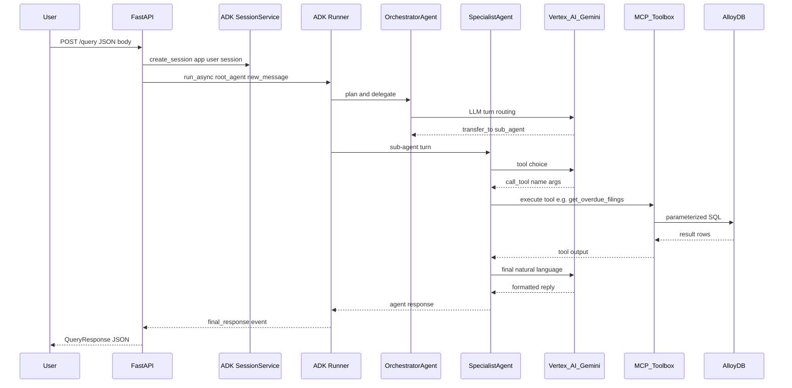

# 🏛️ CA Command Center — Architecture

**Gen AI Academy APAC · Google Cloud × Hack2skill · Multi-Agent Productivity Assistant**

> **Tagline:** A Vertex AI–powered ADK multi-agent system that turns natural language into grounded CA workflows — orchestration, specialist agents, MCP Toolbox tools, and AlloyDB — behind a FastAPI edge on Cloud Run.

---

## 📑 Table of Contents

1. [System Overview](#system-overview)
2. [High-Level Architecture (ASCII)](#high-level-architecture-ascii)
3. [Agent Routing (Mermaid)](#agent-routing-mermaid)
4. [Request Lifecycle (Mermaid Sequence)](#request-lifecycle-mermaid-sequence)
5. [Agent Architecture](#agent-architecture)
6. [Database Schema](#database-schema)
7. [MCP Toolbox Integration](#mcp-toolbox-integration)
8. [GCP Services Architecture](#gcp-services-architecture)
9. [API Endpoints](#api-endpoints)
10. [Security Architecture](#security-architecture)
11. [Scalability & Performance](#scalability-performance)
12. [Local Development Architecture](#local-development-architecture)
13. [Deployment Architecture](#deployment-architecture)
14. [Data Flow Scenarios](#data-flow-scenarios)
15. [Design Decisions](#design-decisions)
16. [Future Architecture Enhancements](#future-architecture-enhancements)

---

## 🧭 System Overview

**CA Command Center** is a productivity operating system for Indian CA firms. A practising CA (or firm staff) sends a **natural-language query** through a **REST API** hosted on **Google Cloud Run**. The request enters an **ADK `LlmAgent`** named **`CA_CommandCenter`**, which acts as the **orchestrator**: it interprets intent using **Gemini 2.0 Flash** on **Vertex AI** and delegates to one of **five specialist sub-agents** (deadlines, clients, documents, alerts, morning reports).

Specialists do not guess statutory dates or client facts. Each sub-agent receives the same **tool bundle** loaded at process startup from the **MCP Toolbox for Databases** (`ToolboxSyncClient.load_toolset("ca-tools")`). When the model selects a tool, the Toolbox runs **parameterized PostgreSQL SQL** against **AlloyDB**, returns rows, and the sub-agent formats an **India-specific**, action-oriented reply (GST/ITR/TDS/ROC terminology, **DD-MM-YYYY** dates).

Secrets → **Secret Manager**; DB → **VPC** + connector from Cloud Run; **Cloud Scheduler** can hit **`POST /query`** for scheduled briefings.

## 🏗️ High-Level Architecture (ASCII)

```
                                    ┌─────────────────────────────────────┐
                                    │           Google Cloud              │
  ┌──────────┐   HTTPS              │  ┌─────────────────────────────┐  │
  │   User   │ ──────────────────►  │  │        Cloud Run            │  │
  │ (CA app) │                      │  │  ┌─────────────────────┐    │  │
  └──────────┘                      │  │  │ FastAPI + Uvicorn   │    │  │
       ▲                            │  │  │  GET /  GET /health │    │  │
       │         JSON response      │  │  │  POST /query        │    │  │
       └────────────────────────── │  │  └──────────┬──────────┘    │  │
                                    │  │             │               │  │
                                    │  │             ▼               │  │
                                    │  │  ┌─────────────────────┐    │  │
                                    │  │  │ OrchestratorAgent   │    │  │
                                    │  │  │ CA_CommandCenter    │    │  │
                                    │  │  │ (ADK LlmAgent)      │    │  │
                                    │  │  └──────────┬──────────┘    │  │
                                    │  │     fan-out │               │  │
                                    │  │   ┌─────────┼─────────┐     │  │
                                    │  │   ▼         ▼         ▼     │  │
                                    │  │ Deadline  Client  Document  │  │
                                    │  │ Agent     Agent   Agent     │  │
                                    │  │   ▼         ▼         ▼     │  │
                                    │  │ Alert    Report            │  │
                                    │  │ Agent    Agent             │  │
                                    │  │   └─────────┬─────────┘     │  │
                                    │  │             │               │  │
                                    │  │   (all share same tools)    │  │
                                    │  └─────────────┼───────────────┘  │
                                    │                │ HTTP (Toolbox)    │
                                    │                ▼                 │
                                    │  ┌─────────────────────────────┐ │
                                    │  │   MCP Toolbox for DBs       │ │
                                    │  │   tools.yaml → postgres-sql │ │
                                    │  └──────────────┬──────────────┘ │
                                    │                 │ Private / IAM │
                                    │                 ▼               │
                                    │  ┌─────────────────────────────┐ │
                                    │  │   AlloyDB (PostgreSQL)      │ │
                                    │  │   clients · deadlines ·     │ │
                                    │  │   tasks · documents · alerts│ │
                                    │  └─────────────────────────────┘ │
                                    └─────────────────────────────────────┘

        Vertex AI ───────────────► Gemini 2.0 Flash (model for every agent)
        Secret Manager ──────────► ALLOYDB_* , GOOGLE_CLOUD_* , TOOLBOX_URL
        Cloud Scheduler ─────────► Optional: POST /query (daily briefing)
```

---

## 🔀 Agent Routing (Mermaid)



---

## ⏱️ Request Lifecycle (Mermaid Sequence)



---

## 🤖 Agent Architecture

| Agent Name | Role | Tools Used | Trigger Keywords (orchestrator routing) |
|------------|------|------------|-------------------------------------------|
| **CA_CommandCenter** (OrchestratorAgent) | Root **ADK** agent: intent detection, delegation to specialists, unified tone | *Delegation only* (sub-agents hold tools) | N/A — entry point for all queries |
| **DeadlineAgent** | GST / ITR / TDS / ROC **deadlines**, mark filed | `get_upcoming_deadlines`, `get_overdue_filings`, `update_deadline_status` | deadline, filing, GST, GSTR, ITR, TDS, ROC, due |
| **ClientAgent** | Client list, **tasks**, add follow-ups | `get_all_clients`, `get_client_tasks`, `add_task` | client, task, add task, follow up, pending work |
| **DocumentAgent** | **Document collection** gaps | `get_pending_documents` | document, Form 16, invoice, pending docs, received |
| **AlertAgent** | **Critical** window (e.g. 3 days), overdue emphasis | `get_upcoming_deadlines` (typically `days=3`), `get_overdue_filings` | alert, urgent, critical, overdue, missed |
| **ReportAgent** | **Daily morning briefing**, cross-cutting summary | `get_upcoming_deadlines` (e.g. 7 days), `get_overdue_filings`, `get_pending_documents`, `get_all_clients` | briefing, morning, today, summary, report |

> **Note:** Sub-agents are configured with the **full** `ca-tools` toolset in code for simplicity; the **LLM** is instructed which tools are primary per agent. Tightening to per-agent tool subsets is a possible hardening step.

---

## 🗄️ Database Schema

### 📐 ERD (conceptual)

- **clients** is the **hub**: one client has many **deadlines**, **tasks**, and **documents**.
- **deadlines** link to **alerts** (reminder rows tied to a specific filing).
- **alerts** do not reference clients directly; resolve client context via **deadlines → clients**.

```text
clients (1) ──────< (N) deadlines
clients (1) ──────< (N) tasks
clients (1) ──────< (N) documents
deadlines (1) ────< (N) alerts
```

### 📋 Table descriptions

| Table | Purpose |
|-------|---------|
| **clients** | Master register: PAN, GST, contact, **category** (business / individual). |
| **deadlines** | Statutory **filing_type**, **due_date**, **status** (pending/filed), **assigned_to**. |
| **tasks** | Firm-internal work: **description**, **priority**, **due_date**, **status** (open/done). |
| **documents** | **doc_type**, **received_date**, **notes** — evidence trail for filings. |
| **alerts** | Precomputed or system **message** rows, **alert_date**, **sent** flag, keyed to **deadline_id**. |

### 🔗 Relationships

- **`deadlines.client_id` → `clients.id`**: every filing belongs to one assessee.
- **`tasks.client_id` → `clients.id`**: tasks are scoped to a client portfolio entry.
- **`documents.client_id` → `clients.id`**: documents roll up per client.
- **`alerts.deadline_id` → `deadlines.id`**: alerts annotate a specific deadline (e.g. overdue banner).

---

## 🔧 MCP Toolbox Integration

### 🔌 What MCP means here

**MCP (Model Context Protocol)**-style tooling lets LLMs call **structured, server-side capabilities** instead of emitting raw SQL. **MCP Toolbox for Databases** is the **middleware**: it holds **connection config** (AlloyDB), exposes **named tools** with **schemas**, and runs **approved statements** with **bound parameters** — reducing injection risk compared to a model writing ad hoc SQL.

### 📄 How `tools/tools.yaml` is organized

| Section | Role |
|---------|------|
| **`sources`** | Named datasource **`alloydb-ca`**: `kind: alloydb-postgres`, project/region/cluster/instance, database `ca_productivity`, credentials from env (`${ALLOYDB_USER}`, `${ALLOYDB_PASSWORD}`). |
| **`toolsets`** | Bundle **`ca-tools`** lists the seven tool names exposed to the app. |
| **`tools`** | Each tool: `kind: postgres-sql`, `source`, `description`, optional `parameters`, and a **`statement`** with `$1`, `$2`, … placeholders. |

The Python app uses **`ToolboxSyncClient(TOOLBOX_URL)`** and **`load_toolset("ca-tools")`** so **ADK** agents receive native **callable tools** bound to that server.

### 🔄 How sub-agents call tools

1. User query reaches **OrchestratorAgent**; ADK routes to a **sub-agent**.
2. Sub-agent **Gemini** turn selects a tool + JSON arguments (e.g. `get_upcoming_deadlines` with `days: 7`).
3. Toolbox executes the **declarative SQL** on AlloyDB and returns **rows**.
4. Model composes the final **user-facing** answer (tables, bullets, follow-up questions).

> **Important:** Keep Toolbox **reachable** from Cloud Run (public endpoint + auth, or **private** via VPC — see Security). **`TOOLBOX_URL`** defaults to `http://localhost:5050` for local dev.

---

## ☁️ GCP Services Architecture

| Service | Purpose | Configuration (typical) |
|---------|---------|-------------------------|
| **Cloud Run** | Host **FastAPI** container; scales to zero; HTTPS endpoint | Region e.g. `asia-south1`, port **8080**, min/max instances, concurrency |
| **AlloyDB** | **PostgreSQL-compatible** transactional store for CA data | Private IP, backups, IAM database auth optional |
| **Vertex AI** | **Gemini 2.0 Flash** for all ADK agents | Project + region; workload identity from Cloud Run SA |
| **Secret Manager** | **ALLOYDB_USER**, **ALLOYDB_PASSWORD**, API keys, **TOOLBOX** auth tokens | Mounted as env or fetched at startup; never in image |
| **Cloud Scheduler** | **Cron** trigger for daily briefing | HTTP target → Cloud Run **`POST /query`** with service account OIDC |
| **VPC Connector** | Egress from Cloud Run to **private** AlloyDB / Toolbox | Serverless VPC Access connector; route only required subnets |

---

## 📡 API Endpoints

Implemented in **`api/main.py`** (FastAPI + **ADK** `Runner` + `InMemorySessionService`).

### 🏠 `GET /`

**Health / discovery** — service metadata and agent list.

```json
{
  "name": "CA Command Center",
  "version": "1.0.0",
  "description": "AI-powered multi-agent system for CA firms",
  "agents": [
    "OrchestratorAgent",
    "DeadlineAgent",
    "ClientAgent",
    "DocumentAgent",
    "AlertAgent",
    "ReportAgent"
  ],
  "status": "running"
}
```

### 💚 `GET /health` — returns `{"status":"healthy","service":"CA Command Center"}`.

### 💬 `POST /query`

**Request body**

```json
{
  "query": "I just started my day. Give me my morning briefing.",
  "user_id": "ca_user_001",
  "session_id": "default_session"
}
```

**Response body**

```json
{
  "response": "… natural language briefing / task list …",
  "agent_used": "CA_CommandCenter",
  "status": "success"
}
```

| Field | Type | Notes |
|-------|------|-------|
| `query` | string | **Required** user message |
| `user_id` | string | Default `ca_user_001` — maps to ADK session identity |
| `session_id` | string | Default `default_session` — conversation continuity |

---

## 🔐 Security Architecture

- **VPC:** Private **AlloyDB**; **Serverless VPC Connector** on Cloud Run (same for private Toolbox).
- **Secrets / IAM:** **Secret Manager** for DB + Toolbox creds; dedicated Cloud Run SA with **least privilege** (Vertex, secrets); prefer **Workload Identity**.
- **Toolbox:** Only reviewed SQL in `tools.yaml`; **bound parameters** (no string-concat SQL).
- **API:** Protect **`POST /query`** (IAP, API keys, OAuth); avoid public unauth except demos.

---

## 📈 Scalability & Performance

- **Cloud Run** scales on request rate; tune **CPU/memory** for Gemini + Toolbox latency.
- **InMemorySessionService** is **not multi-instance safe** — use a **persistent** ADK session store to scale out.
- **AlloyDB** pooling: cap connections from Toolbox/app under burst load.
- **Gemini 2.0 Flash** optimizes cost/latency per hop; optional **tool-result cache** (short TTL) can cut tokens.

---

## 💻 Local Development Architecture

```text
Terminal A: MCP Toolbox server (tools.yaml + alloydb-ca source)
            ▲
            │ TOOLBOX_URL=http://localhost:5050
Terminal B: Python 3.11 venv
            uvicorn api.main:app --reload --host 0.0.0.0 --port 8080
            ▲
            │ Vertex AI credentials (gcloud application-default login)
Browser/curl: http://localhost:8080/query
```

- **`.env`:** `TOOLBOX_URL`, `GOOGLE_CLOUD_PROJECT`, `GOOGLE_CLOUD_REGION`, AlloyDB credentials (or point Toolbox at a **local Postgres** mirror for offline dev).
- **Database:** Apply schema + `database/seed_data.sql` so tools return realistic rows.
- **Tests:** `tests/` can mock Toolbox or run integration tests against a test DB.

---

## 🚀 Deployment Architecture (Cloud Run)

- **Image:** Python 3.11-slim, `requirements.txt`, app code.
- **CMD:** `uvicorn api.main:app --host 0.0.0.0 --port 8080` (repo `Dockerfile` may use `adk api_server` — align for your deployment).
- **Env:** `TOOLBOX_URL`, `GOOGLE_CLOUD_PROJECT`, `GOOGLE_CLOUD_REGION`; secrets from **Secret Manager**.
- **Network:** VPC connector for private AlloyDB; egress for **Vertex AI**. **Logging** / **Error Reporting**; avoid PII in logs.

---

## 🔄 Data Flow Scenarios

### ☀️ Scenario 1 — "Give me my morning briefing"

```text
User
  → POST /query { query: "… morning briefing …" }
  → OrchestratorAgent matches keywords (briefing | morning | summary | report)
  → ReportAgent selected
  → Tools: get_overdue_filings, get_upcoming_deadlines(7), get_pending_documents, get_all_clients
  → MCP Toolbox runs each SQL → AlloyDB
  → ReportAgent synthesizes formatted briefing
  ← JSON { response, agent_used, status }
```

### ✅ Scenario 2 — "Mark GSTR-3B as filed for Rajesh Enterprises"

```text
User
  → POST /query { query: "Mark GSTR-3B filed for Rajesh Enterprises" }
  → OrchestratorAgent routes to DeadlineAgent (GST | GSTR | filing)
  → Tool: update_deadline_status(client_name, filing_type)
  → SQL UPDATE deadlines … SET status = 'filed' … RETURNING …
  ← Confirmation with client_name, filing_type, due_date, status
```

---

## 🧠 Design Decisions

| Decision | Rationale |
|----------|-----------|
| **Google ADK** | First-class **multi-agent** patterns (`LlmAgent`, `sub_agents`, `Runner`, sessions) aligned with **Vertex** and **Gemini** — less bespoke orchestration code. |
| **MCP Toolbox** | **Centralized**, **reviewable** SQL + **parameter binding** + **AlloyDB** auth in one place — clearer security story than per-agent connection strings. |
| **AlloyDB on GCP** | **PostgreSQL** skills and tooling transfer directly; **GCP-native** HA and integration with VPC/IAM for a coherent hackathon → production path. |
| **Single toolset for all sub-agents** | Faster iteration; routing instructions constrain **which** tools each agent prefers. Split toolsets later for **least privilege**. |
| **FastAPI façade** | Simple **REST** contract for judges, mobile apps, and **Cloud Scheduler**; keeps UI/clients decoupled from ADK internals. |

---

## 🔮 Future Architecture Enhancements

1. **Persistent sessions & multi-tenancy** — Replace in-memory session service with a **store** (e.g. Firestore / Redis) keyed by **firm_id** and **user_id** for horizontal scale and audit trails.
2. **Event-driven briefings & WhatsApp bridge** — **Pub/Sub** + **Cloud Functions** to push digest snippets to clients; Scheduler remains the clock, events carry **idempotent** notification IDs.
3. **Read replicas & caching** — Route heavy **report** queries to an **AlloyDB read pool** and add **short TTL cache** for identical tool results to cut latency and token use during peak filing season.
